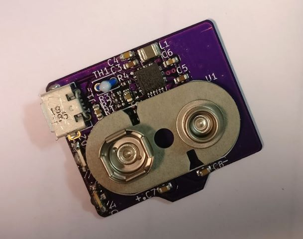

# LEGO HUB-mod, rechargable battery

## Project
The Project was created using KiCAD 5.1.5.
Should be manufactured on a <0.8mm thick PCB (eg. oshpark's 2oz copper service).
The "production" directory has an "interactive bom" to assist with the hand assembly.

## Features
- USB charging at about 400mA
- TI BQ25886, 2A boost charger, optimized for 2S Li-Ion
- NTC
- connector for an 8.4V battery

Recommended battery:
[Soshine 9V 650mAh 6F22](https://lygte-info.dk/review/batteries9V/Soshine%209V%20LiIon%20650mAh%20(White)%20UK.html)

## Finished build
### Board assembled

### USB input

### Charging indicators
- red: charging
- green: power

